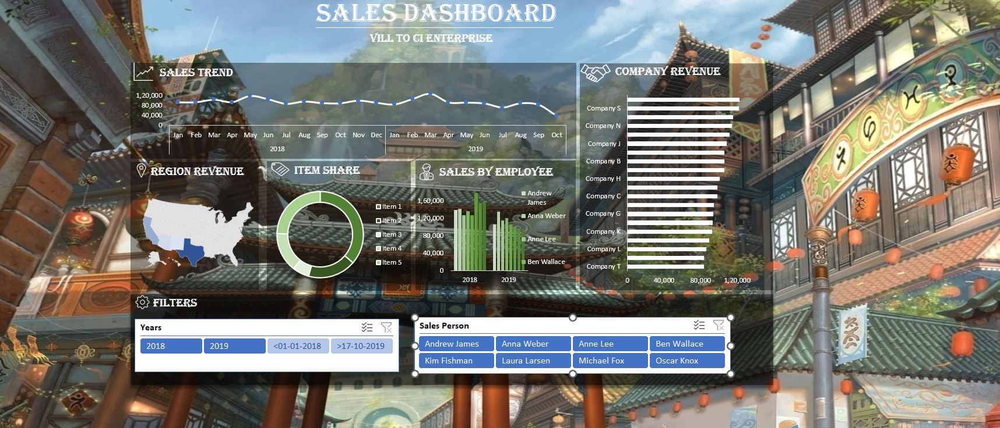

# Excel Dashboard

## **Overview**
This Excel Dashboard provides a comprehensive and interactive way to visualize data, allowing users to gain insights and make informed decisions. The dashboard consolidates data from various sources and presents it in a user-friendly format, including charts, graphs, and tables.

## **Features**
- **Interactive Charts**: Dynamic charts that update based on user selections.
- **Data Filtering**: Easily filter data using dropdown menus to focus on specific metrics.
- **Visualizations**: Multiple visualization options, including bar charts, pie charts, and line graphs.
- **User-Friendly Interface**: Intuitive layout for easy navigation and data exploration.

## **Getting Started**
To get started with the Excel Dashboard, follow the steps below:

### Step 1: Download the Dashboard
- Download the Excel Dashboard file from the repository.
- Ensure you have Microsoft Excel installed on your machine.

### Step 2: Open the File
- Open the downloaded Excel file in Microsoft Excel.
- Enable macros if prompted to ensure all features function correctly.

### Step 3: Navigate the Dashboard
- Familiarize yourself with the layout of the dashboard.
- Use the provided menus and buttons to interact with the data.

### Step 4: Update Data
- To update the dashboard with new data, replace the data in the designated data sheets.
- Ensure the new data follows the same structure as the original dataset.

### Step 5: Save Changes
- After making updates, save the Excel file to preserve your changes.
- Consider saving a copy of the original dashboard file for backup.

## **Screenshot**

  

## **Contributing**
Contributions are welcome! If you have suggestions or improvements, please fork the repository and submit a pull request.

